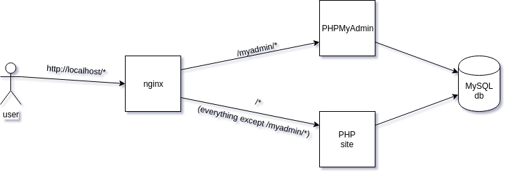

# POCO Example: Nginx, PHP, Apache, PHPMyAdmin

This is example of [poco](https://github.com/shiwaforce/poco) application. This is the architecture:

If you have an istalled POCO, clone/fork this repository, and in project folder open a terminal:

`poco up`

After a few seconds (after new docker images downloaded and started) you can visit [localhost](http://localhost/index.php) or [PHPMyAdmin](http://localhost/myadmin/index.php)

To install poco here is the [documentation](https://getpoco.io/documentation/install/)
